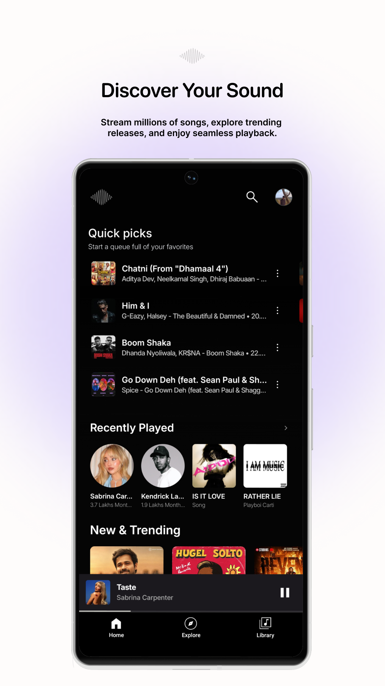
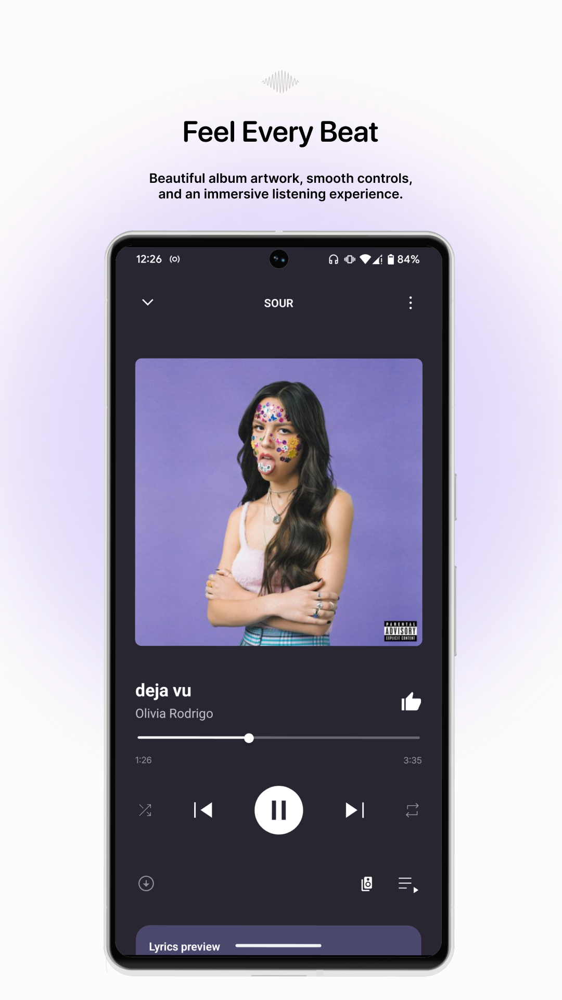
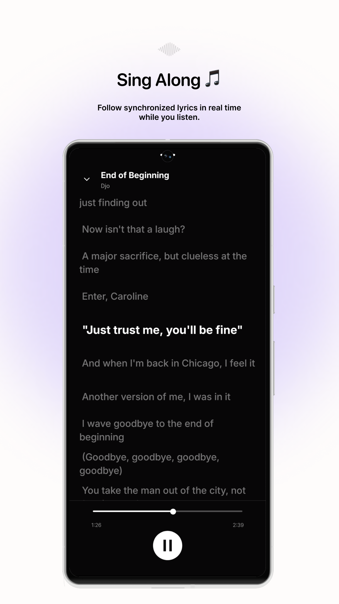
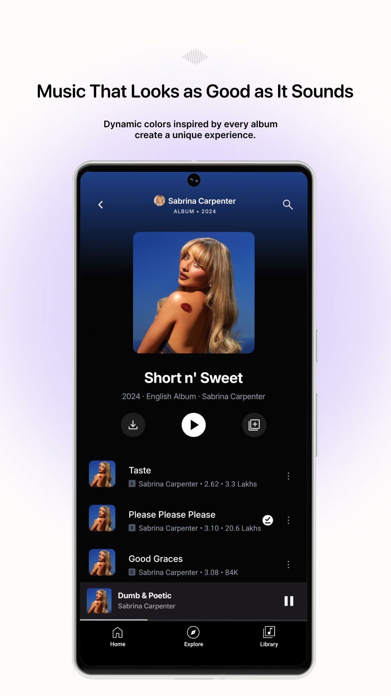
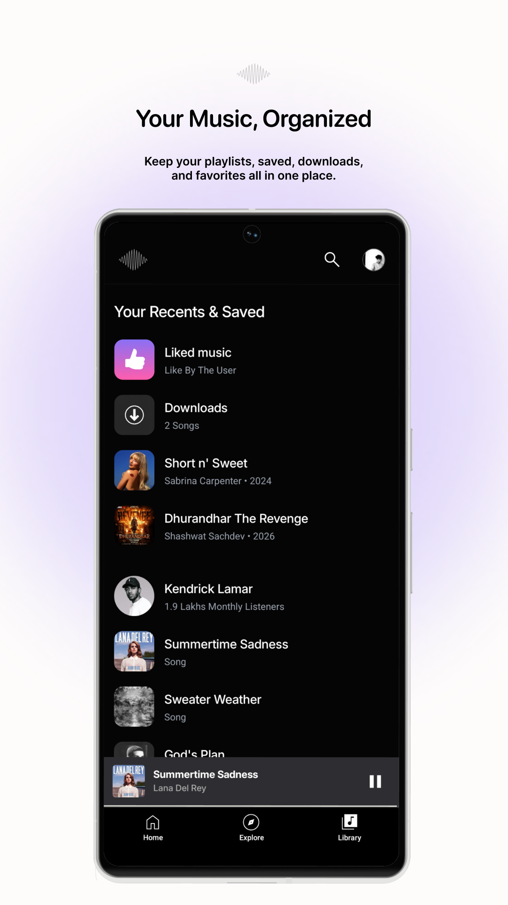

  
  <h1>Beats</h1>

A Android open-source music streaming application. 
A beautiful, feature-rich music playback experience built with **React Native** for Android.

---

  
  
  
  
  

## 🌃 Features

- 📖 **Open-source & Ads Free**: Enjoy a completely free music experience with absolutely no interruptions.
- 🎧 **Stream, Download & Offline Playback**: Listen to high-quality audio up to 320kbps. Download your favorite songs and easily play them offline without an internet connection.

- 🎤 **Real-Time Synced Lyrics**: Sing along to your favorite tracks with perfectly synced, real-time lyrics.

- 🌍 **Global & Regional Library**: Explore a massive library featuring top Indian hits and worldwide trending songs.

- ✨ **Clean & Modern UI**: Navigate through a beautifully crafted, user-friendly interface designed for the best experience.

## 📜 ⬇️ Installation guide

### 🚀 Ready to experience Beats?

 

👇 **Click on the button below to download the app!**

 

 
 

> [!TIP]
> **Safe & Direct Download**
> This button links directly to the official `.apk` file on GitHub Releases. It completely bypasses third-party websites and annoying browser security warnings!

## 💼 License

Beats is open source software licensed under the [MIT License](LICENSE).

---

## ⚠️ Disclaimer

**This project is strictly for educational and learning purposes only.** 
Beats is a personal, non-commercial open-source project created to learn React Native development. It does not host any audio files or content on its own servers. The creators and contributors are not responsible for any copyright infringement, misuse, or legal issues that may arise from using this application or its source code.
